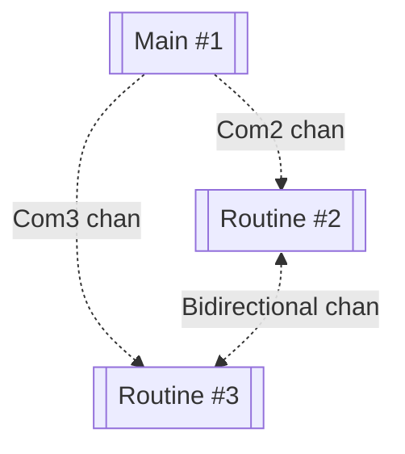

## Run
`go run .` from concurrency/channels folder

## Design

## Best practices
- inter-routine communication via channels
- use for..range to read from channel or for loop with a condition if channel closed
- use select if you listen on multiple channels
- separate data and signal channel. Send inputs for processing on data, send signals like processing suspended on signal channel, close only the signal channel (you can use context for timely deadline)
- use sync.Once method to make sure channel only closed once
- use worker pools to exercise tight control on the number of routines started to process data
- 

