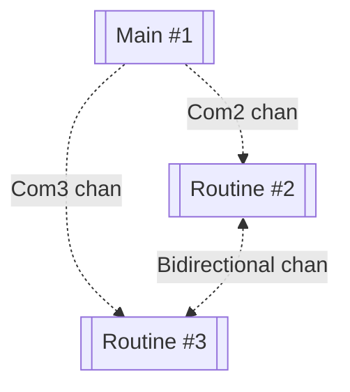

## Run
`go run .` from concurrency/channels folder

## Design

```mermaid
flowchart TD
    A[[Main #1]] -.Com2 chan.-> B[[Routine #2]]
    A -.Com3 chan.-> C[[Routine #3]]
    
    B <-.Bidirectional chan.-> C
```